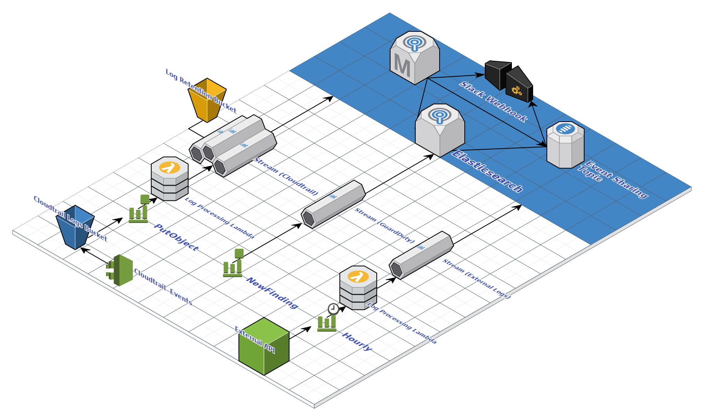

# Eager-Locomotive - Security Monitoring Stack 🚂
(Kinesis+ElasticSearch+Kibana Stack for Security Monitoring)

## Overview

  As of March 2019, Amazon Web Services does not have a way of easily analyzing the logs it's services produce. The native AWS solutions are difficult to search, offer little retention capability, and lack robust alerting.

  The purpose of this project is to greatly simplify the process of deploying a basic security monitoring stack on AWS by defining the entire stack as a repeatable `Terraform` plan.

Features

* ElasticSearch - Scalable cluster for log consolidation
* Cloudtrail - Management and data events delivered to ElasticSearch
* Lambda - Delivers JSON blobs to Kinesis streams
* Kinesis Stream - Scalable event queue for incoming log data
* Kinesis Firehose - Real-time delivery of events from streams, to ElasticSearch
* Extensible - Adding a log sources is simple and efficient

## Architecture 

## Currently Implemented
* Enable and configure Cloudtrail
* Configure ElasticSearch
* Configure IAM Policies
* Configure S3 Buckets
* Lambda for sending Cloudtrail events to ElasticSearch
* CloudWatch event trigger for sending events to ElasticSearch
* Assign Cloudtrail event triggers

## Pending Implemention

* Enable GuardDuty monitoring
 * Send new GuardDuty findings to the monitoring stack
  * create new kinesis stream 
  * configure cloudwatch event triggers
